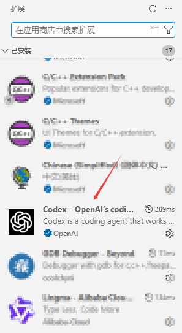
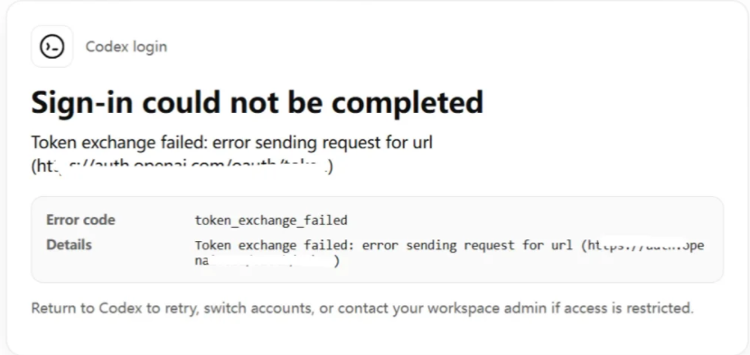
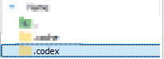
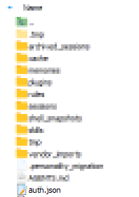
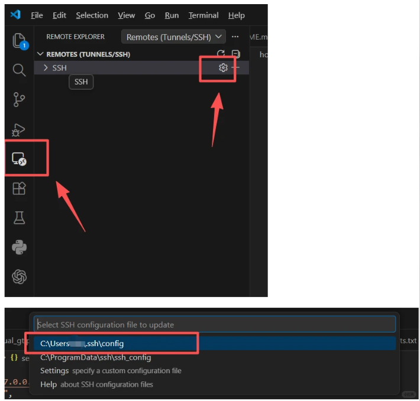
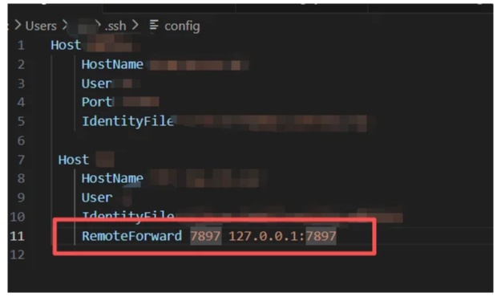
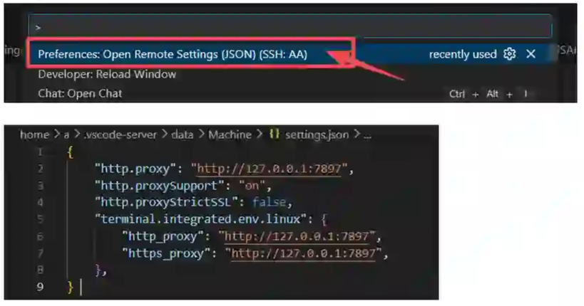

# VS Code Codex Local and Remote Server Deployment Guide

This guide explains how to sign in to the Codex extension in **local VS Code** and on an **SSH remote server**. It also shows how to use `auth.json`, SSH `RemoteForward`, and remote proxy settings to resolve common remote sign-in failures.

> **Security notice:** `auth.json` is an authentication cache file and may contain sensitive authorization information. Only copy it to your own remote server configuration directory. **Do not commit it to GitHub, do not publish it, and do not share it with others.** This repository should ignore `auth.json` through `.gitignore`.

## Table of Contents

- [1. Sign in to Codex in Local VS Code](#1-sign-in-to-codex-in-local-vs-code)
- [2. Upload Local auth.json to the Remote Server](#2-upload-local-authjson-to-the-remote-server)
- [3. Configure SSH RemoteForward](#3-configure-ssh-remoteforward)
- [4. Configure Remote VS Code Proxy Settings](#4-configure-remote-vs-code-proxy-settings)
- [5. Restart VS Code and Verify Remote Sign-in](#5-restart-vs-code-and-verify-remote-sign-in)
- [6. Troubleshooting](#6-troubleshooting)

## 1. Sign in to Codex in Local VS Code

1. Make sure your network environment can access the official OpenAI sign-in page.
2. Open local VS Code, go to the Extensions panel, and search for the Codex extension.



3. Click the sign-in entry in the Codex extension and choose to sign in with your GPT / OpenAI account.
4. VS Code will redirect you to the official `openai.com` sign-in page. Complete sign-in with your account password or verification code.
5. After sign-in succeeds, the Codex interface should display a status similar to `Signed in to Codex`.

If sign-in fails, you may see an error page similar to the following:



When this happens, first check whether your network can reliably access `openai.com`. If necessary, switch to a stable network route and try signing in again.

## 2. Upload Local auth.json to the Remote Server

Before signing in to Codex on the remote server, make sure the Codex extension in local VS Code has already signed in successfully. Then upload the local `auth.json` generated after successful sign-in to the Codex configuration directory on the remote server.

### 2.1 Find auth.json on Windows

The default Windows path is usually:

```text
C:\Users\YOUR_USERNAME\.codex\auth.json
```

Confirm that this file exists and that it was generated after a successful local Codex sign-in.

### 2.2 Upload auth.json to the remote server

After connecting to the remote server through VS Code SSH, find the `.codex` configuration folder under the remote user home directory. The path is usually similar to:

```text
/home/YOUR_USERNAME/.codex/
```



Upload the local `auth.json` file to this directory:



After upload, the remote path should usually be:

```text
/home/YOUR_USERNAME/.codex/auth.json
```

## 3. Configure SSH RemoteForward

Open the SSH configuration file in VS Code:



Add `RemoteForward` to the target server's `Host` block. For example, if your local proxy port is `7897`, use the following configuration:

```sshconfig
Host your-server
    HostName xxx.xxx.xxx.xxx
    User your_username
    Port 22
    IdentityFile ~/.ssh/id_rsa
    RemoteForward 7897 127.0.0.1:7897
```



Explanation:

- The first `7897` is the forwarded port opened on the remote server.
- `127.0.0.1:7897` is the local proxy address and port on your local machine.
- If your local proxy port is not `7897`, replace both ports with your own port number.

## 4. Configure Remote VS Code Proxy Settings

In VS Code, press:

```text
Ctrl + Shift + P
```

Search for and open:

```text
Preferences: Open Remote Settings (JSON)
```



Add the following configuration to the remote settings JSON. The example below uses port `7897`. If your port is different, replace it accordingly.

```json
{
  "http.proxy": "http://127.0.0.1:7897",
  "http.proxySupport": "on",
  "http.proxyStrictSSL": false,
  "terminal.integrated.env.linux": {
    "http_proxy": "http://127.0.0.1:7897",
    "https_proxy": "http://127.0.0.1:7897"
  }
}
```

If your remote settings file already contains other settings, do not overwrite the entire file. Merge the fields above into the existing JSON object and make sure the final JSON syntax is valid.

## 5. Restart VS Code and Verify Remote Sign-in

After completing the configuration, restart VS Code so that SSH forwarding and remote proxy settings can take effect.

Then verify the setup as follows:

1. Reconnect to the remote server through SSH.
2. Open the Codex extension in the remote VS Code window.
3. Try signing in or check the current sign-in status.
4. If the interface shows `Signed in to Codex` or a similar status, Codex sign-in on the remote server has succeeded.

If remote sign-in still fails, check the following items first:

- Whether local Codex has signed in successfully.
- Whether `/home/YOUR_USERNAME/.codex/auth.json` exists on the remote server.
- Whether `RemoteForward` is added to the correct `Host` block in the SSH config.
- Whether the proxy port is consistent across `RemoteForward` and Remote Settings.
- Whether VS Code has been fully restarted and reconnected to the remote server.

## 6. Troubleshooting

### 6.1 What should I do if `Sign-in could not be completed` appears?

This error usually means Codex could not complete the token exchange during sign-in. Check the following in order:

1. Confirm that the current network can access `openai.com`.
2. Switch to a stable network route and try signing in again.
3. Confirm that Codex in local VS Code has already signed in successfully.
4. Confirm that the `auth.json` generated after successful local sign-in has been uploaded to the remote server.
5. Confirm that the remote VS Code proxy is configured as `http://127.0.0.1:YOUR_PORT`.
6. Restart VS Code and reconnect to the remote server.

### 6.2 Can I commit auth.json to GitHub?

No. `auth.json` is an authentication cache file and should not be committed publicly. Only upload the tutorial, screenshots, and configuration templates to GitHub. Do not upload the real `auth.json` file.

### 6.3 Does the port have to be 7897?

No. `7897` is only an example port. Use your own local proxy port and make sure the port is consistent in all of the following places:

1. The `RemoteForward` entry in SSH config.
2. The `http.proxy` value in Remote Settings JSON.
3. The `http_proxy` and `https_proxy` values under `terminal.integrated.env.linux`.
